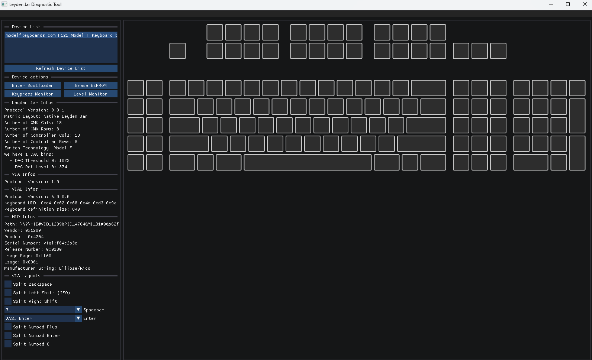

# The Leyden Jar Diagnostic Tool

The Leyden Jar Diagnostic Tool is an application meant to perform troubleshooting and inspection on Leyden Jar controller firmwares.

## The Leyden Jar controller project

The [Leyden Jar](https://en.wikipedia.org/wiki/Leyden_jar) is a modernized controller PCB for the Brand New Model F and Beam Spring keyboards and is pin compatible with the good old XWhatsit controller we all know. 

This is an open source project, available on GitHub at the following link [here](https://github.com/mymakercorner/Leyden_Jar).

## Inspiration

Pandrew did a similar tool for the XWhatsit controller, his fundamental ideas have been applied to the Leyden Jar Diagnostic Tool with the addition of some new features and small improvements. 

## Benefits

Usage of this tool can benefit both firmware developers and end users.

### Firmware developers

Writing a firmware for a new Model F or Beam Spring keyboard is a rather involved process. This tool can help inspect various states of the keyboard including reading the analogic levels of each key.
This eases the process of tuning some firmware parameters. 
This can also help find software issues, and also can help find and understand hardware issues as well.

### End users

The program allow to easily make the controller go into bootloader mode (to flash a new firmware) or to erase the EEPROM that can contain VIA keys/layers configurations.  

It is not uncommon for keys to stop working after shipping or transportation or because of a bad keycap installation.  
If some keyboard keys don't work as intended the tool can help investigate the issue. 

## Features

* List all Leyden Jar compatible HID devices.
* EEPROM reset.
* Enter bootloader.
* Display various QMK/VIA/VIAL infos.
* Display various Leyden Jar related infos.
* Keypress monitor.
* Analog levels monitor.
* Different view types:
    * keyboard layout.
    * logical(QMK) matrix.
    * physical(controller) matrix.
* VIAL layouts management:
    * automatic detection.
    * in app selection/view of different VIAL layout configurations.

## License

This project is provided with the very permissive MIT license.

## Compatibility

The tool is developped on Windows so it is kwown to build and run nicely on this  platform.

Thanks to **idollar** and later **ToriningenGames** users some adaptations have been made so that the tool compiles and run on Linux platforn as well.

The project itself is cross-platform friendly and should be easily adapted to other OSes like MacOSX.

**NOTE:**

Under Linux the tool must be run with root privileges in order to work.

## Build

CMake utility is used for generating the build files, the CMakeLists.txt file checks that you have at least version 3.21 installed.

### About Git submodules 

This projet uses Git submodules.  
If you use a desktop GUI for managing Git repositories (like Git Extensions for example) chances are that the tool takes care cloning the submodules when cloning the main project repository.
If you are a Git command line user (either on Windows or on Linux) you must ensure that the submodules are cloned as well before starting the build process.

#### When cloning the main repository

Call the following command to clone the main project repository and also its Git submodules:

> git clone --recurse-submodules https://github.com/mymakercorner/Leyden_Jar_Diagnostic_Tool.git

#### When the main repository is already cloned

From the project base directory call the following commands:

> git submodule init  
> git submodule update

### Windows 

You will need to have Visual Studio 2022 installed on your computer, a community edition will work perfectly.  
Execute GenerateBuildForVS2022.bat script, the Visual Studio solution should then be created inside the build directory. 

### Linux(untested)

Execute GenerateBuildForUnix.sh to generate build files in the build directory.

### MacOSX(untested)

Execute the same GenerateBuildForUnix.sh shell script to generate build files in the build directory.

## Acknowlegments

This project uses several other software packages as GIT sub modules.

### SDL

A famous cross-platform windowing API under the ZLIB license: https://github.com/libsdl-org/SDL  

### minlzma

A very good minimal LZMA decoding library under the MIT license: https://github.com/ionescu007/minlzma

### jsoncpp

A widely used json parsing library provided under the MIT license: https://github.com/open-source-parsers/jsoncpp

### hidapi

A raw HID library, used under the original HIDAPI license: https://github.com/libusb/hidapi

### Dear ImGui

A stunning and easy to use immediate graphical user interface library provided under the MIT license: https://github.com/ocornut/imgui
